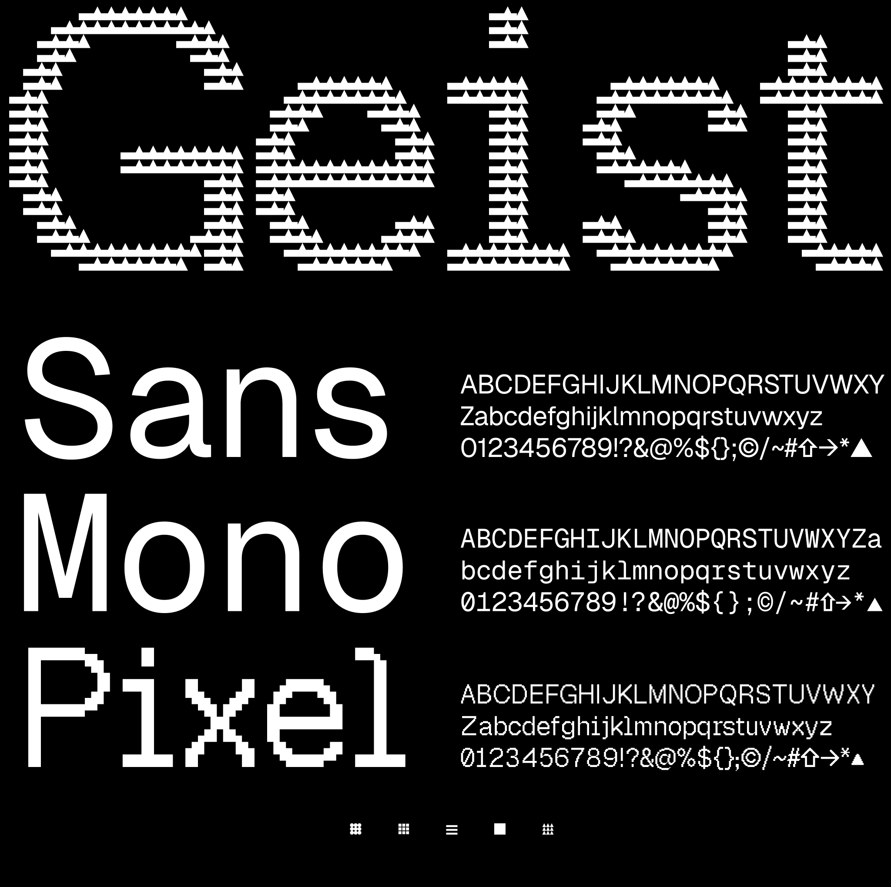

# Geist Sans & Geist Mono
Geist is a new font family for Vercel, created by [Vercel](https://vercel.com/design) in collaboration with [Basement Studio](https://basement.studio/).

Geist Sans is a sans-serif typeface designed for legibility and simplicity. It is a modern, geometric typeface that is based on the principles of [classic Swiss typography](https://en.wikipedia.org/wiki/International_Typographic_Style). It is designed to be used in headlines, logos, posters, and other large display sizes.

Geist Mono is a monospaced typeface that has been crafted to be the perfect partner to Geist Sans. It is designed to be used in code editors, diagrams, terminals, and other textbased interfaces where code is represented.

### Installation

```sh
npm install geist
```

### Using with Next.js

#### App Router

In your `app/layout.js`:

```jsx
import { GeistSans } from "geist/font";

export default function RootLayout({
  children,
}: {
  children: React.ReactNode
}) {
  return (
    <html lang="en" className={GeistSans.className}>
      <body>{children}</body>
    </html>
  )
}
```

#### Pages Router

In your `pages/_app.js`:

```jsx
import { GeistSans } from "geist/font";

export default function MyApp({ Component, pageProps }) {
  return (
    <main className={GeistSans.className}>
      <Component {...pageProps} />
    </main>
  )
}
```

### License
The Geist font family is free and open sourced under the [SIL Open Font License](./LICENSE.TXT).

### Inspiration
Geist has been influenced and inspired by the following typefaces: [Inter](https://fonts.google.com/specimen/Inter), [Univers](https://www.linotype.com/1567/univers-family.html), [SF Mono](https://developer.apple.com/fonts/), [SF Pro](https://developer.apple.com/fonts/), [Suisse International](https://www.swisstypefaces.com/fonts/suisse/), [ABC Diatype Mono](https://abcdinamo.com/typefaces/diatype), and [ABC Diatype](https://abcdinamo.com/typefaces/diatype). We thank the creators of these typefaces for their craft.
